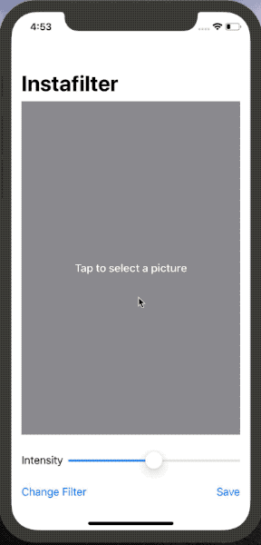

# Instafilter

**Image manipulation using Core Data & SwiftUI.**



#### Technologies used:
- SwiftUI
- Core Image

### Day 62

#### Creating custom bindings in SwiftUI

To take an acttion when blurAmount changes, we need to create a custom Binding struct that acts as a passthrough around blurAmount:

```Swift
struct ContentView: View {
    @State private var blurAmount: CGFloat = 0

    var body: some View {
        let blur = Binding<CGFloat>(
            get: {
                self.blurAmount
            },
            set: {
                self.blurAmount = $0
                print("New value is \(self.blurAmount)")
            }
        )

        return VStack {
            Text("Hello, World!")
                .blur(radius: blurAmount)

            Slider(value: blur, in: 0...20)
        }
    }
} 
```

### Day 63 - Wrapping UIViewController in a SwiftUI view


### Day 64 - SwiftUI Coordinators

### Day 65

#### If let in SwiftUI
Swift has support for only a small amount of logic inside SwiftUI layouts – we can use if someCondition, but we can’t use if let, for, while, switch, and so on.

What’s actually happening here is that Swift is able to convert if someCondition into a special internal view type called ConditionalContent: it stores the condition and the true and false views, and can check it at runtime. However, if let creates a constant, and switch can have any number of cases, so neither can be used.

So, the fix here is to replace if let with a simple condition, then rely on SwiftUI’s support for optional views:

```Swift
if image != nil {
    image?
        .resizable()
        .scaledToFit()
} else {
    Text("Tap to select a picture")
        .foregroundColor(.white)
        .font(.headline)
} 
```


#### Custom Bindings

Custom bindings that rely on properties of our view need to be created inside the body property of the view, because Swift doesn’t allow one property to reference another.

```Swift
let intensity = Binding<Double>(
    get: {
        self.filterIntensity
    },
    set: {
        self.filterIntensity = $0
        self.applyProcessing()
    }
) 
```

Important: Now that there is some logic inside the body property, you must place return before the NavigationView, like this: return NavigationView {.


### Day 66

#### ActionSheet

Same pattern as the .sheet modifier:

```Swift
.actionSheet(isPresented: $showingFilterSheet) {
    ActionSheet(title: Text("Select a filter"), buttons: [
    .default(Text("Sepia Tone")) { self.setFilter(CIFilter.sepiaTone()) },
    .default(Text("Vignette")) { self.setFilter(CIFilter.vignette()) },
    .cancel()
])
} 
```

#### Saving an image to the Photos Album

We need to use wrap UIImageWriteToSavedPhotosAlbum() with a class that inherits NSObject, so that it has a callback method that is marked with @objc:

```Swift
class ImageSaver: NSObject {
    func writeToPhotoAlbum(image: UIImage) {
        UIImageWriteToSavedPhotosAlbum(image, self, #selector(saveError), nil)
    }

    @objc func saveError(_ image: UIImage, didFinishSavingWithError error: Error?, contextInfo: UnsafeRawPointer) {
        // save complete
    }
} 
```
The actual save/fail (with error) can be sent back to SwiftUI - so check the final implementation for that.

### Day 67 - Challenges
1. Try making the Save button show an error if there was no image in the image view.
2. Make the Change Filter button change its title to show the name of the currently selected filter.
3. Experiment with having more than one slider, to control each of the input keys you care about. For example, you might have one for radius and one for intensity.